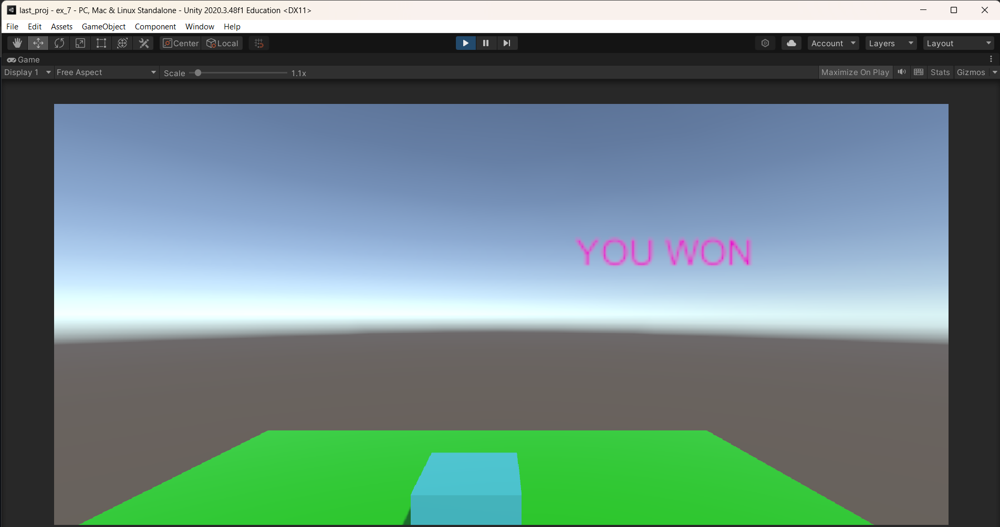
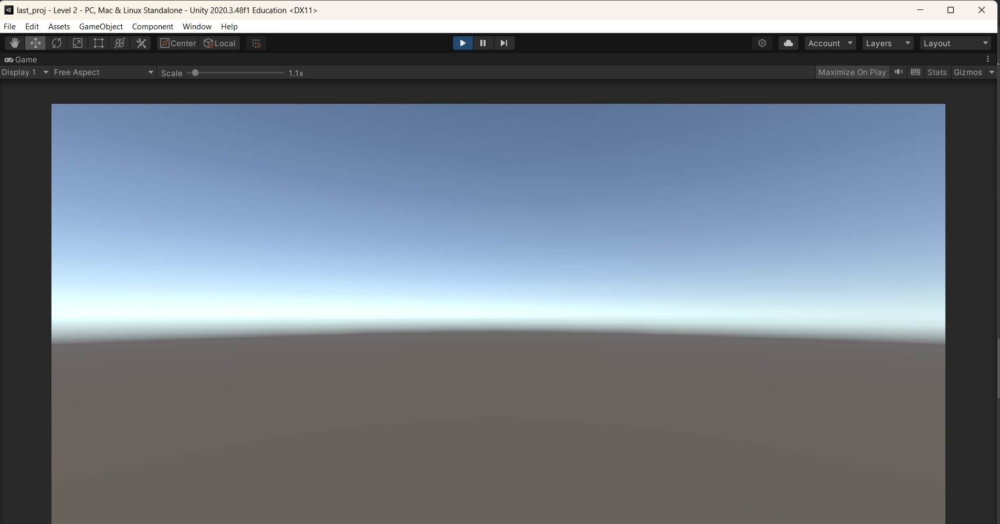

# Ex06-Redirecting-the-Scene
### Aim:
To Redirecting the scene in the unity engine.

### Algorithm:
Step 1: To open the unity engine.

Step 2: Create a new 3D project.

Step 3: Create plane and name it as ground and create cube and name it as player.

Step 4: Add WinText in Hierarchy.

Step 5: Create a C# Script and name it as playercontroller and add the script to player.

Step 6: Use the R button to change the level2

Step 7 Print the Output and end the program.

### Program:
```
NAME : UDHAYA SANKARAN M
REG NO: 212222110051
```
```
using System.Collections;
using System.Collections.Generic;
using UnityEngine;
using UnityEngine.SceneManagement;


public class cube : MonoBehaviour
{
    Rigidbody rb;
    public GameObject WinText;
    // Start is called before the first frame update
    void Start()
    {
        rb=GetComponent<Rigidbody>();
    }

    // Update is called once per frame
    void Update()
    {
        if (Input.GetKeyDown(KeyCode.R))
        {
            SceneManager.LoadScene("Level 2");
        }
    }
    private void OnCollisionEnter(Collision Other)
    {
        if (Other.gameObject.tag=="Destroy")
        {
            Destroy(Other.gameObject);
            WinText.SetActive(true);
        }
    }
}
```
### Output:




### Result:
The above C# coding is successfully redirecting the scene in the unity engine.
### Result:
The above C# coding is successfully redirecting the scene in the unity engine.